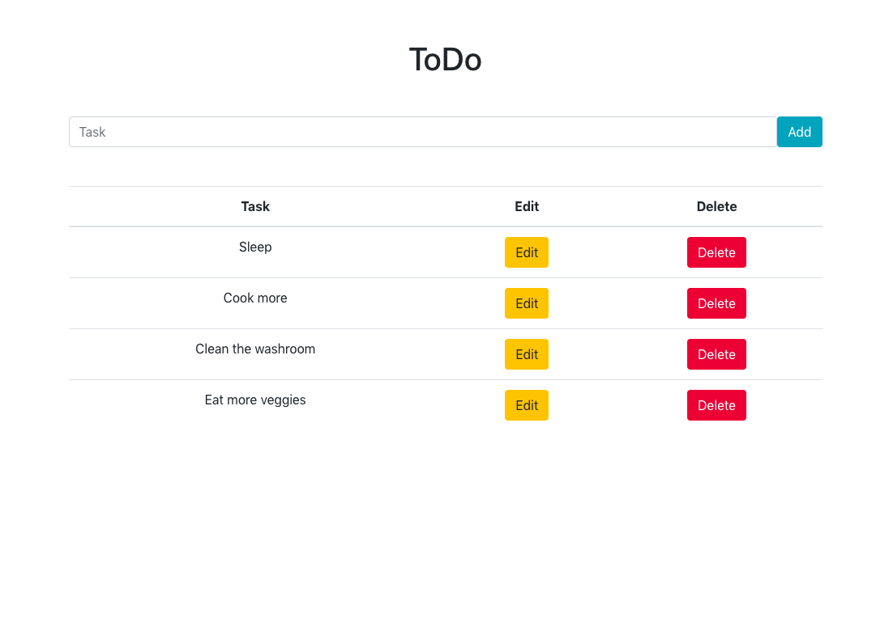
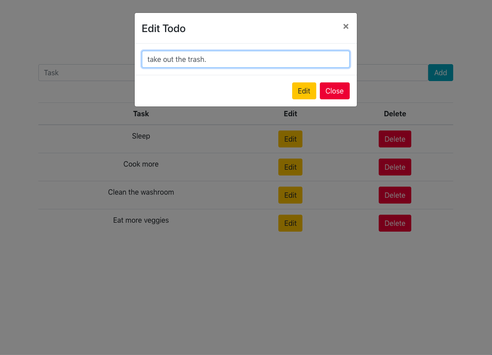

# Bookd Up

## About
A litle refresh on the CRUD operations using the PERN stack. Also an opprotunity to learn async await, http fetch requests, and more.


### Home Page



### Edit Function




## Running the Project

run both front end and back end folders in seperate terminals with:

```sh
npm start
```

## PERN Stack
- PostgreSQL
- Express
- React
- Node.js